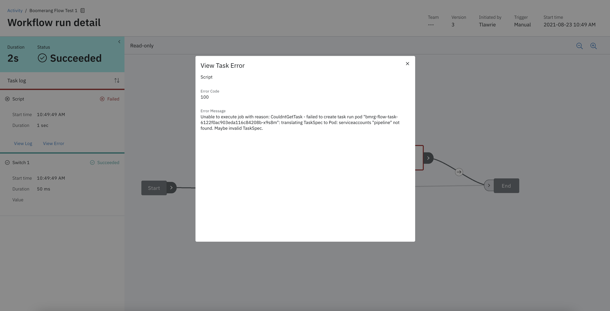

# Installing

Boomerang Flow is packaged as a Helm<sup>®</sup> 3 chart with the values documented in the chart. Please make sure to read the [prerequisites](/docs/boomerang-flow/installing/pre-requisites) prior to installing.

## Installation steps

To get started quickly, install into a Kubernetes<sup>®</sup> cluster of 1.13+ via Helm, using the following commands:

**Step 1**

`helm repo add boomerang-io https://raw.githubusercontent.com/boomerang-io/charts/index`

**Step 2**

> **Note:** The configurable parameters of the chart and their default values can be found [here](https://github.com/boomerang-io/charts/tree/main/bmrg-flow#configuration).

> **Note:** If `workers.security.enable` is set to `true`, `workers.security.policy` should be set to a **privileged** PodSecurityPolicy (Kubernetes based platforms) / SecurityContextConstraint (OpenShift based platforms).

Install or upgrade the Helm chart using the relevant Helm commands and passing in any properties. By default, Flow will install in standalone mode with eventing via NATS disabled.

```sh
helm install --namespace <namespace> --set database.mongodb.host=<service_name> --set database.mongodb.secretName=<mongodb_secret> boomerang-io/bmrg-flow
```

## Post installation

### First Time Activation wizard

When installing Boomerang Flow in standalone mode, you will be presented with a token in the output of the Helm command, with some instructions on how to navigate to the installed running application.

Upon navigating to the links provided, a First Time Activation wizard appears, and redirection will occur, until the one-time activation token is provided.

This is an important step to ensure that an Administrator account is dynamically created, providing the user the correct entitlements to perform the post installation configuration steps.

<!-- TODO: get image of the activation process -->

### Post installation configuration

After installation and activation, you will be able to administer the settings. These are dynamic configurations that can be changed during runtime. This ensures don't have to provide this via the values YAML at installation time, as there is nothing worse than having to put together a values YAML with greater than 100 values!

Currently, these settings will affect how the workers interface and execute. See [Workers and Execute](/docs/boomerang-flow/architecture/worker-and-executor-architecture) for details.

## Issues Installing

If you encounter issues installing Boomerang Flow you can reach out on our Slack channels. The following are some of the known issues faced.

### No Pipelines ServiceAccount

If you are attempting to run Workflows and they are coming up with an error including `serviceaccounts "pipeline" not found` then its most likely that the pipelines service account needed by Tekton is not found. This can be solved by creating the required serviceaccount and rolebinding. Typically we link to a priviledged clusterrole.

```sh
kubectl create serviceaccount pipeline
kubectl create rolebinding pipeline-rolebinding --serviceaccounts <namespace>:pipeline --clusterrole=<clusterrole>
```

