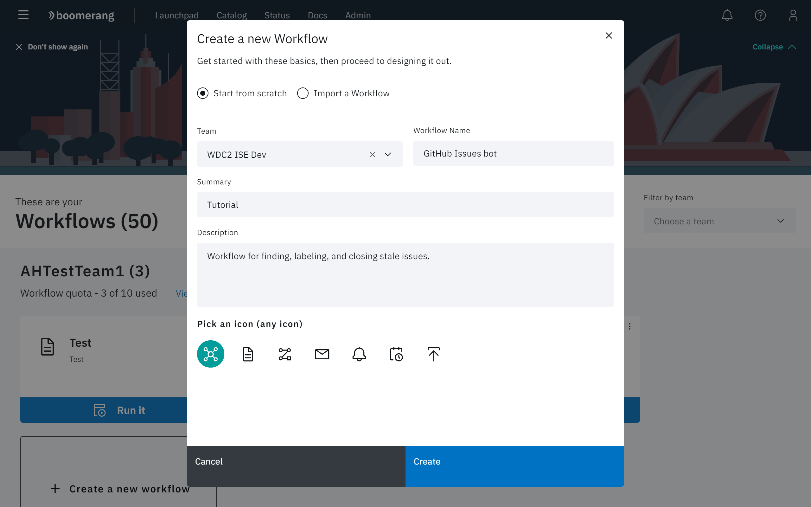
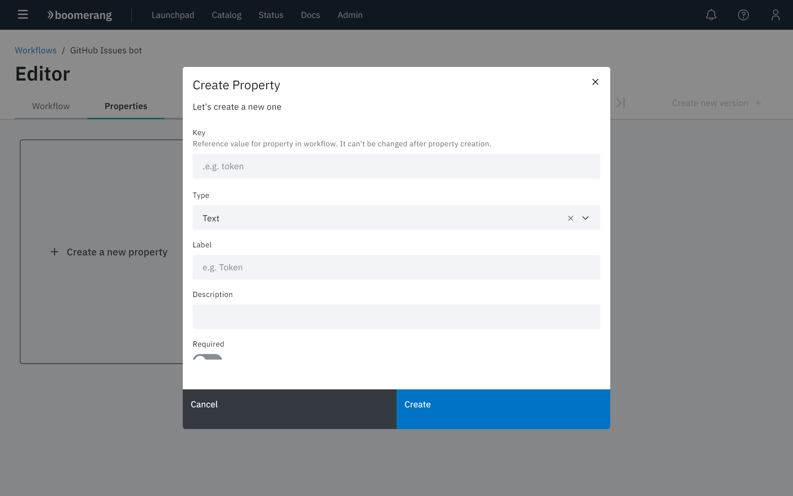

# GitHub Issues bot

The following use cases describe how you can set up a GitHub® Issues bot using Boomerang Flow with no code. These bots are useful in finding, labeling, and closing stale issues after a period of inactivity.

> You will _need_ a GitHub Personal Access token for a user that has access to the repository.

> You will _also need_ access to Boomerang Flow.

## Create your flow

First, create your new Workflow by navigating to the Workflows page and clicking **Create new Workflow**. At the modal, choose to **Start from scratch**, fill in the details, and select **Create**.

You are taken to the Workflow Editor for this particular Workflow. In the left panel of the Workflows page, expand the GitHub category. Identify the Tasks that we will use today: **Find Issues and Label** and **Find Issues and Remove**.

Drag these Tasks onto the screen. Edit each Task with the following parameters, using the pencil icon at the top of the Task.

For the **Find Issues and Label** Task, enter the following specifics

- Endpoint: can be left with the default `https://github.ibm.com/api/v3`
- Token: Your personal access token
- Owner: the GitHub organization that your repository is in such as `boomerang-workers`
- Repository: the name of the repository such as `boomerang.worker.flow`
- Days Since Activity: `14 days`
- Label: `stale`
- Ignore Label: `bot ignore`

For the **Find Issues and Remove** Task, enter the same specifics, omitting the **Ignore Label**.

Next, wire these Tasks together by dragging a line from **Start** to **Find Issues and Label** then **Find Issues and Remove** and **End**. You do not need to change any of the status checks, as one Task should always run after the prior Task.

To learn more about this, navigate to _Getting to Know_ | _Editor_ | _Links_ in the Flow documentation.

## Schedule your Flow

In the **Configure** tab, enable the **Scheduler** trigger. This bot should run every day. To do this, you can use the standard UI method with no advanced cron knowledge. Click **Change schedule**. At the **Change schedule** modal, select the desired days and set the bot to run at 6:00 AM Eastern Standard Time every day.

## Testing your Flow

To test out your Workflow, run this manually from the Workflows page. When you run it against a repository that has an issue inactive for greater than 14 days, you will see a 'stale' label added to the issue. A message is also posted in the issue.

<!--  -->

## Advanced Configuration

A more advanced method of setting up this Workflow is to use Workflow properties. You can create the **API Endpoint URL**, **Token**, **GitHub Owner**, and **Label** with the Workflow properties and use the same properties in both Tasks, providing one central place to manage and configure these properties.

You achieve this by using the property resolution feature available throughout Flow and the specific notation of `${p:propertyName}`

1. Navigate to the properties tab of the Workflow and click **Create a New Property**.
2. For the API Endpoint URL, enter the following details in the modal, and click **Create**.

- Key: `url`
- Type: URL
- Label: API Endpoint
- Description: The GitHub API endpoint to connect to
- Required: toggle to true
- Default Value: https://github.ibm.com/api/v3

3. Navigate back to the Workflow tab and open one of the GitHub Tasks via the edit pencil. Replace the URL by entering the notation of `${p:url}` or you can start typing `url` and you will be provided a prompt list to select.

You can now do this for each of the fields that are common and do not change in each of the Task windows.
