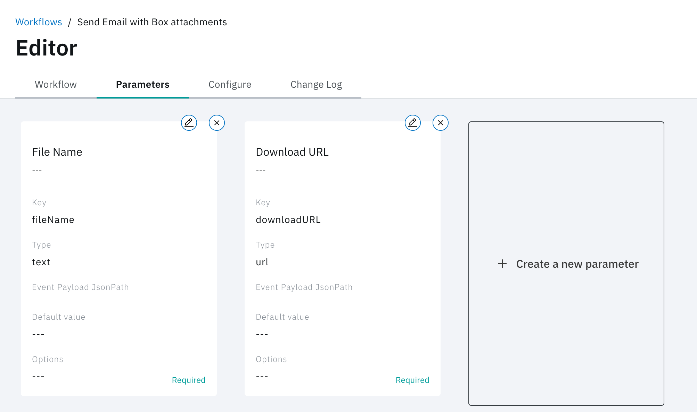
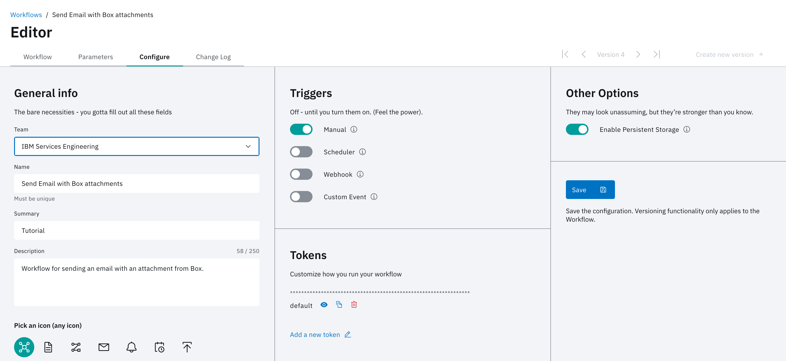

# Sending email with attachments hosted on Box

The following use cases describe how you can send emails with attachments hosted on Box<sup>®</sup>, using Boomerang Flow with no code. These are useful in business Workflows that requires sending emails with attachments, either generated within the Workflow or hosted on an artifact storage system like Box.

> You will _need_ a publicly accessible file hosted on Box for the Task to download.

> You will _also need_ access to Boomerang Flow.

## Create your flow

First, lets create the new Workflow by navigating to the Workflows page and clicking **Create new Workflow**. At the modal, choose to **Start from scratch**, fill in the details, and select **Create**.


You are taken to the Workflow Editor for this particular Workflow. In the tabbed menu, select the **Parameters** and define two _Required_ parameters, named **fileName** and **downloadURL**.



In the left panel of the Workflows tabbed page, expand the Utilities category and drag onto the canvas the **Execute Shell** Task. After that, expand the Communication category and drag onto the canvas the **Send Email with Sendgrid** Task. These are the two Tasks that we are going to use in this tutorial.

Edit each Task with the following parameters, using the pencil icon at the top of the Task.

For the **Execute Shell** Task, enter the following specifics

- Directory Path: The folder where the files will get downloaded `/Workflow`
- Shell Interpreter: `bash`
- Shell Script: this script creates a files folder and download the file into it. Paste in the following snippet

```
mkdir files
curl -L $(params.downloadURL) --output /Workflow/files/$(params.fileName)
```

For the **Send Email with Sendgrid** Task, enter the following specifics

- API Key: Your SendGrid's account API
- To: The email address where the email to will be sent
- From: The contact who is sending the email. It must match a validated identity from the SendGrid account
- Subject: The subject of the email
- Content Type: Either `Text` or `HTML`
- Attachments: The files that are to be attached to the email, pointing to the downloaded file path `/Workflow/files/$(params.fileName)`


Next, you wire these Tasks together by dragging a line from **Start** to **Execute Shell** then **Send Email with Sendgrid** and **End**. You do not need to change any of the status checks, as one Task should always run after the prior Task.

To learn more about this, navigate to _Getting to Know_ | _Editor_ | _Links_ in the Flow documentation.

The last step is to enable the Workflow persistence storage by going to the Configure tab and from the right panel switch the toggle **Enable Persistence Storage**. Press **Save** button.



## Testing your Flow

To test out your Workflow, you can run this manually from the Workflows page. Identify the newly created Workflow and click **Run it**. In the Workflow Parameters window fill in the parameter values and press **Run** or **Run and View**.


